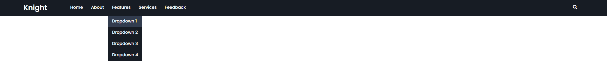

# Navbar Collection

Collection of Navbars in HTML CSS.

> Emphasis of this project is on building hand-coded Navbar's avoiding the use of Bootstrap or JavaScript

- [x] Static Blue
- [x] Mega Menu
- [x] Knight
- [x] Mini Tab
- [x] Overlord

### Task List

- [ ] Continue to Build on Existing Collection of Navbar's

# Footers

<h1 align="center">
Static Blue

Mega Menu

Knight

Mini Tab

Overlord

</h1>
